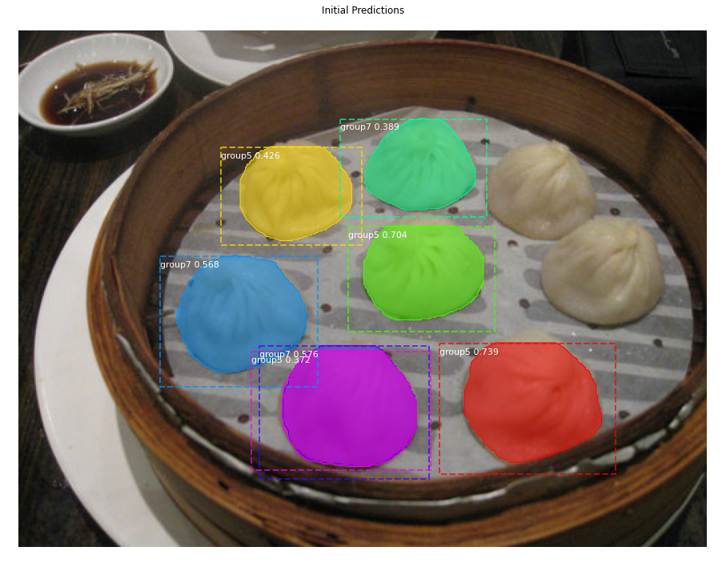
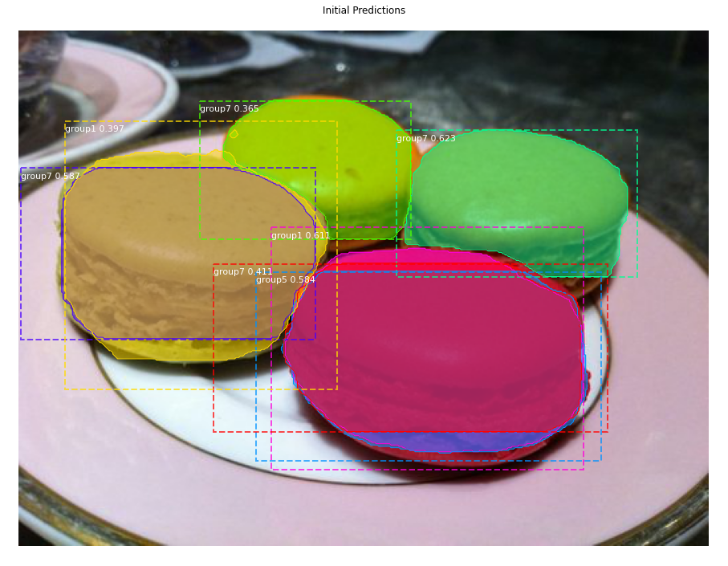

# Food Detection using Mask R-CNN
This project utilizes Mask R-CNN to detect food in images. The model is based on Matterport's implementation of [Mask R-CNN](https://github.com/matterport/Mask_RCNN).

### Dataset
All images are sourced from the [Food-101](https://data.vision.ee.ethz.ch/cvl/datasets_extra/food-101/) dataset and annotated using [VGG Image Annotator](https://www.robots.ox.ac.uk/~vgg/software/via/). There are 160 images per category for training and 20 images per category for validation.

### Methodology
To address the limited availability of data, we decided to divide the 50 food categories into 7 groups. During the prediction process, each image undergoes an initial general prediction that assigns regions to their respective groups. Subsequently, the regions are cropped based on their bounding box predictions and then predicted using their corresponding model. There is a total of 8 models are used to maximize accuracy.

### Results
All results below are from the initial detection.

